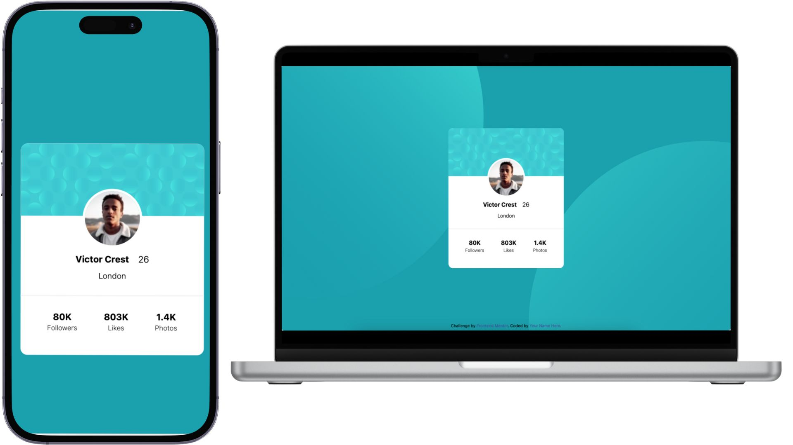

# Frontend Mentor - Profile card component solution

This is a solution to the [Profile card component challenge on Frontend Mentor](https://www.frontendmentor.io/challenges/profile-card-component-cfArpWshJ). Frontend Mentor challenges help you improve your coding skills by building realistic projects. 

## Table of contents

- [Overview](#overview)
  - [The challenge](#the-challenge)
  - [Screenshot](#screenshot)
  - [Links](#links)
- [My process](#my-process)
  - [Built with](#built-with)
  - [What I learned](#what-i-learned)
  - [Continued development](#continued-development)
  - [Useful resources](#useful-resources)
- [Author](#author)

## Overview

### The challenge

- Build out the project to the designs provided

### Screenshot

### Links

- Solution URL: [Add solution URL here](https://your-solution-url.com)
- Live Site URL: [Add live site URL here](https://your-live-site-url.com)

## My process

### Built with

- HTML
- Mobile-first workflow
- [Tailwind CC](https://tailwindcss.com/) - CSS Framework
- [Next.js](https://nextjs.org/) - NodeJS for Tailwind CSS CLI

### What I learned

I learned a lot about how to use the simple Utility-First CSS Framework, Tialwind CSS, to build out the sides super fast without writing much CSS myself. Setting up the project was a bit of a challenge since I had to setup NodeJS and TailwindCSS CLI to output the final CSS stylesheet that would be deployed

### Continued development

I want to focus on using CSS frameworks such as Tailwind CSS more often to allow for more customization, even though it does mean more classes added to every single element in my HTML. 

I really do like this approach as it does cut down on some CSS writing time.

I would also like to further my knowledge of using this framework with React component building.

### Useful resources

- [Tailwind CSS CheatSheet](https://tailwindcomponents.com/cheatsheet/) - This helped me use the correct class for each change that I needed to make for the elements using tailwind CSS

## Author

- Website - [Arash Soltani](https://www.soltaniworld.com)
- Frontend Mentor - [@soltaniworld](https://www.frontendmentor.io/profile/soltaniworld)
